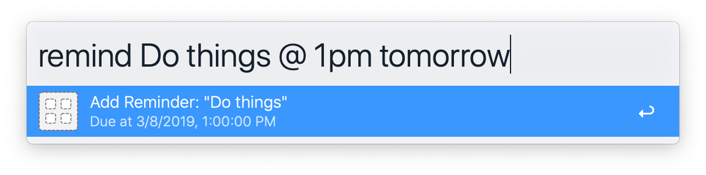

# alfred-remind



Simple Alfred workflow for Reminders

## Install

```
$ npm install --global alfred-remind
```

*Requires [Node.js](https://nodejs.org) 8+ and the Alfred [Powerpack](https://www.alfredapp.com/powerpack/).*


## Usage

In Alfred, type `remind`, then your reminder. Add a due date by appending it after ` @ `.

Examples:

```
remind Do things

remind Do things @ 1pm

remind Do things @ 1pm tomorrow

remind Celebrate New Years @ 1/1 next year

remind Do things @ 12/1/2019 at 3pm
```

## License

MIT © [Daniel Bridges](http://danbridges.org)
